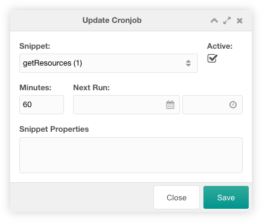

## Setup the cron script

After the installation, you need to configure the cron script in your servers
crontab list. On most hostings you have a control panel like Direct Admin
available and mostly you're able to configure cronjobs via that control panel.
If you have access to there server with SSH could add the cronjob with the
"crontab -e" command. Add the following line as cronjob:

```
php /path/to/your/modx/installation/assets/components/cronmanager/cron.php
```

!!! note
    In some cases this command needs some modifications (i.e. the path to a
    version specific php file). Please discuss this with your hosting provider.

The cron connector could also be called as an external webcronjob using the
following url:

```
https://your.domain/assets/components/cronmanager/cron.php?cronjob_id=xxx
```

The value xxx has to be filled with the random string in the MODX system setting
`cronmanager.cronjob_id`

We advise you to execute it on every minute, every day in every month (* to all:
m h dom mon dow). But if you're sure, that there are no needs for an every
minute cronjob, you could change the crontab interval to your own needs.

## Custom Manager Page 

To use the component, navigate to your manager and click on "Extras > CronManager".


You could create a new cronjob with a click on the create new cronjob button on
the top left above the cronjob grid.

The grid could be filtered by the snippet name with a search input on the top
right above the cronjob grid.
    
Each cronjob could be edited by a click on the edit icon in the row of the
cronjob. The log of the cronjob could be seen with a click on the list icon in
the row of the cronjob. It could be deleted after a confirmation with a click on
the trash icon in the row of the cronjob.

The row of each cronjob shows the executed snippet, the minute interval, the
last and the next run and the active state of an entry. The minutes and the
active state could be edited inline with a double click. The last and the next
run column will contain a date when the cron script is executed.

## Create/Edit

The create/edit window for one cronjob has a lot of options, that could be set.



You could set the executed snippet, the active state, the minute interval, the
next run and the snippet properties. The snippet is executed on the `site_start`
resource, and it should return a json array: `{"error": boolean, "message":
"string"}`. If not, the output will be saved in the log message and the log
entry will be set to successful. The minute interval sets the interval the
snippet is executed. Example: If you enter 15, the snippet would run every 15
minutes (when the cron.php file is called every minute). The snippet properties
could contain key-value pairs (each on a new line in the format `key: value`), a
JSON object or the name of a propertyset.

The snippet cannot be terminated with `exit()`, because the CronManager is also
terminated with this exit. So it cannot write any success or error message to
the database. Since version 1.2.2 `CronManager: 1` is added as default snippet
property to detect if the snippet is executed by CronManager. Since version
1.2.4, the current modCronjob instance can be passed as snippet property
`CronManagerJob` to the executed snippet. This has to be enabled with the
`cronmanager.pass_modcronjob` MODX system seetting. This way the snippet can
determine, which job triggered it, it can change and save the modCronjob
instance to i.e. disable the cron job.

!!! caution 
    After adding a cronjob, it isn't active. You have to change the active state
    to yes in the `Active` column of the overview or check the checkbox in the 
    edit window.

## System Settings

CronManager uses the following system settings in the namespace `cronmanager`:

| Key                         | Name                   | Description                                                                                                                                                                                                                 | Default |
|-----------------------------|------------------------|-----------------------------------------------------------------------------------------------------------------------------------------------------------------------------------------------------------------------------|---------|
| cronmanager.cronjob_id      | Cronjob ID             | String, that has to be added to the cronjob URL as cronjob_id parameter.                                                                                                                                                    | -       |
| cronmanager.debug           | Debug                  | Log debug information in the MODX error log.                                                                                                                                                                                | No      |
| cronmanager.pass_modcronjob | Pass modCronjob        | Pass the modCronjob instance to the executed snippet in the CronManagerJob snippet property. Disable the option if the cronjob snippet throws an "Object of class modCronjob_mysql could not be converted to string" error. | No      |
| cronmanager.purge_running   | Purge Running Cronjobs | Number of minutes after which running cronjobs are cleaned up in order to reset cronjobs that are no longer responding.                                                                                                     | 60      |
